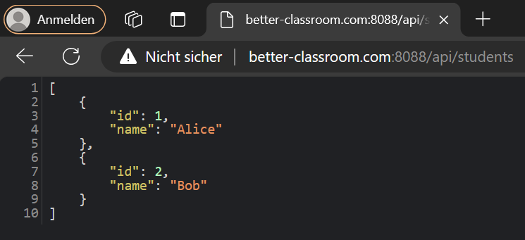
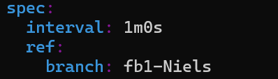

# Better Classroom Kubernetes Setup Guide

## Table of Contents

1. [Local Development](#local-development)
2. [Accessing Databases](#accessing-databases)
3. [Accessing Staging and Production Environments](#accessing-staging-and-production-environments)
4. [Merge Process](#merge-process)
5. [Testing WebSockets](#testing-websockets)

## Local Development

### Prerequisites

- WSL 2
- Docker
- Kubernetes (kubectl)

### Setup Steps

1. **Start WSL and Docker**

2. **Install k3d**

   ```bash
   brew install k3d
   # or
   curl -s https://raw.githubusercontent.com/k3d-io/k3d/main/install.sh | bash
   ```

3. **Run k3d**

   ```bash
   k3d cluster create mycluster -p "8088:80@loadbalancer"
   ```

4. **Verify Kubernetes Context**

   ```bash
   kubectl config current-context
   ```

   

5. **Install Flux CLI**

   ```bash
   brew install fluxcd/tap/flux
   # or
   curl -s https://fluxcd.io/install.sh | sudo FLUX_VERSION=2.0.0 bash
   ```

6. **Create Flux Namespace**

   ```bash
   kubectl create namespace flux-system
   ```

   

7. **Create GitLab Secret**

   ```bash
   kubectl create secret generic gitlab-token \
     --from-literal=username=<Gitlab Username> \
     --from-literal=password=<Gitlab Token> \
     -n flux-system
   ```

8. **Connect Flux to Git Repo**

   ```bash
   flux install
   flux install --components=image-reflector-controller,image-automation-controller

   flux create source git gitlab-repo \
     --url=https://gitlab.in.htwg-konstanz.de/lehre/meiglspe/sose24/betterclassroom.git \
     --branch=main \
     --interval=1m \
     --secret-ref=gitlab-token

   flux create kustomization betterclassroom \
     --source=GitRepository/gitlab-repo \
     --path="./kubernetes" \
     --prune=true \
     --interval=1m
   ```

9. **Add Registry Secrets**

   ```bash
   kubectl create secret docker-registry my-registry-secret \
     --docker-server=registry.gitlab.in.htwg-konstanz.de \
     --docker-username=<Gitlab Username> \
     --docker-password=<Gitlab Token> \
     --docker-email=<Gitlab Mail> \
     --namespace=betterclassroom

   kubectl create secret docker-registry my-registry-secret \
     --docker-server=registry.gitlab.in.htwg-konstanz.de \
     --docker-username=<Gitlab Username> \
     --docker-password=<Gitlab Token> \
     --docker-email=<Gitlab Mail> \
     --namespace=flux-system
   ```

10. **Edit Hosts File**
    - On Windows open `C:\Windows\System32\drivers\etc\hosts` with administrative privileges (or `/etc/hosts` on Linux)
    - Add: `127.0.0.1 better-classroom.com`

### Accessing the Application

Frontend: http://better-classroom.com:8088/


Backend: http://better-classroom.com:8088/api/students



### Manually Update Deployments

```bash
cd betterclassroom/kubernetes
kubectl delete -f backendDeployment.yaml
kubectl apply -f backendDeployment.yaml
```

### Change Branches Locally

1. Change Flux Branch:

   ```bash
   export EDITOR=nano
   kubectl edit gitrepository flux-system -n flux-system
   # or if that does not work
   kubectl edit gitrepository -n flux-system
   ```

   

2. Update `backendDeployment.yaml` and `frontendDeployment.yaml` with branchname
   

## Accessing Databases

### Port Forwarding

```bash
kubectl port-forward svc/mongodb -n betterclassroom 27017:27017
```
Note: `kubectl port-forward` does not return. To continue, you will need to open another terminal.

### Connect to MongoDB


```bash
mongosh --host 127.0.0.1 --port 27017
```
Note: Requires the [MongoDB Shell](https://www.mongodb.com/docs/mongodb-shell/install/)

## Accessing Staging and Production Environments

### Staging

- Frontend: http://betterclassroom-staging.in.htwg-konstanz.de:8080/
- Backend: http://betterclassroom-staging.in.htwg-konstanz.de:8080/api/<API ROUTE>

### Production

- Frontend: http://betterclassroom.in.htwg-konstanz.de/
- Backend: http://betterclassroom.in.htwg-konstanz.de/api/<API ROUTE>

## Merge Process

1. Create feature branch from main
2. Update files to reflect current feature branch name
3. Develop and test in local cluster

    - The local cluster updates automatically after push to Git, or you can update it manually (see "Manually Delete and Apply New Versions").
    - Local Cluster access:
      - [http://better-classroom.com:8088/](http://better-classroom.com:8088/)
      - [http://better-classroom.com:8088/api](http://better-classroom.com:8088/api)

4. Merge stable version to main branch (passed Peer Review)
5. Create tag from main branch
6. Update main branch files to reflect tag name
7. Test in staging environment
8. Merge main to production branch
9. Update production branch files to reflect tag name

## Testing WebSockets

### Production

Use the following HTML to test WebSockets in production:

```html
<!DOCTYPE html>
<html lang="en">
  <head>
    <meta charset="UTF-8" />
    <meta name="viewport" content="width=device-width, initial-scale=1.0" />
    <title>SocketIO Test</title>
    <script src="https://cdnjs.cloudflare.com/ajax/libs/socket.io/4.0.0/socket.io.js"></script>
    <script>
      document.addEventListener("DOMContentLoaded", function () {
        const socket = io("ws://betterclassroom.in.htwg-konstanz.de/student", {
          path: "/api/socket.io",
          transports: ["websocket"],
        });

        socket.on("connect", function () {
          console.log("Connected to server");
        });

        socket.on("response", function (data) {
          console.log("Server says:", data.data);
          document.getElementById("serverResponse").textContent = data.data;
        });

        function sendMessage() {
          var message = document.getElementById("messageInput").value;
          socket.emit("message", message);
        }

        document
          .getElementById("sendMessage")
          .addEventListener("click", sendMessage);
      });
    </script>
  </head>
  <body>
    <h1>SocketIO Communication Test</h1>
    <input type="text" id="messageInput" placeholder="Type your message here" />
    <button id="sendMessage">Send Message</button>
    <p>Server response: <span id="serverResponse"></span></p>
  </body>
</html>
```

### Local Testing

For local testing, use:

```
ws://better-classroom.com:8088/api/socket.io/?EIO=4&transport=websocket&path=/api/socket.io/student
```

### Edit Staging, Production Branch Settings

ssh admin@141.37.29.38

Password: K****

swap k3d cluster context (Staging, Production): 

k3d cluster list

kubectl config get-contexts

kubectl config use-context <Kontext-Name>

kubectl config current-context

k9s

