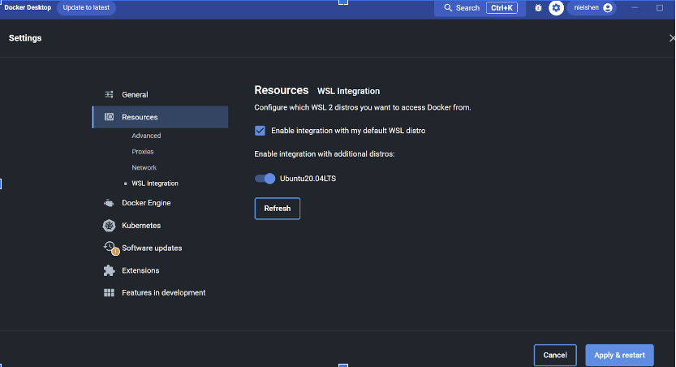
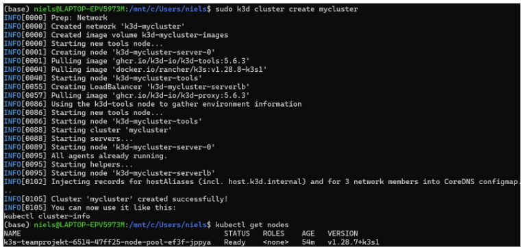

####Anleitung lokal development (windows):

- start wsl 2
- Install and run Docker

- Install K3D
```brew install k3d```
or
```curl -s https://raw.githubusercontent.com/k3d-io/k3d/main/install.sh | bash```
- run K3D
```sudo k3d cluster create mycluster```

- ```sh kubectl get nodes```

- install flux cli
```sh brew install fluxcd/tap/flux```
- create secret
```sh kubectl create namespace flux-system```


``` sh
kubectl create secret generic gitlab-token \
  --from-literal=username=<Gitlab Username> \
  --from-literal=password=<Gitlab Token> \
  -n flux-system
```
  
- start flux 
``` sh
flux bootstrap gitlab \
  --hostname=gitlab.in.htwg-konstanz.de \
  --owner=lehre/meiglspe/sose24 \
  --repository=betterclassroom \
  --branch=main \
  --path=./kubernetes \
  --token-auth \
  --secret-name=gitlab-token 
```
- add registry secret


###Access Database
```kubectl port-forward svc/my-mongodb 27017:27017```

``mongo --host 127.0.0.1 --port 27017``

