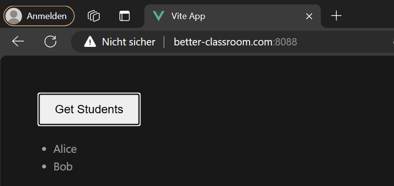

#### Local development:

- start wsl 2
- Install and run Docker
- Install K3D
```brew install k3d```
or
```curl -s https://raw.githubusercontent.com/k3d-io/k3d/main/install.sh | bash```
- Run K3D
```k3d cluster create mycluster -p "8088:80@loadbalancer"```

    
```kubectl config current-context```


- Install flux cli
```brew install fluxcd/tap/flux```
- Create namespace
```kubectl create namespace flux-system```


- Create secret

``` sh
kubectl create secret generic gitlab-token \
  --from-literal=username=<Gitlab Username> \
  --from-literal=password=<Gitlab Token> \
  -n flux-system
```
  
- Connect flux to the Git Repo
```flux install```

```flux install --components=image-reflector-controller,image-automation-controller```
```
flux create source git gitlab-repo \
  --url=https://gitlab.in.htwg-konstanz.de/lehre/meiglspe/sose24/betterclassroom.git \
  --branch=main \
  --interval=1m \
  --secret-ref=gitlab-token
flux create kustomization betterclassroom \
  --source=GitRepository/gitlab-repo \
  --path="./kubernetes" \
  --prune=true \
  --interval=1m
```

- Add registry secrets

```sh 
kubectl create secret docker-registry my-registry-secret \
  --docker-server=registry.gitlab.in.htwg-konstanz.de \
  --docker-username=<Gitlab Username> \
  --docker-password=<Gitlab Token> \
  --docker-email=<Gitlab Mail> \
 --namespace=betterclassroom
```
```sh 
kubectl create secret docker-registry my-registry-secret \
  --docker-server=registry.gitlab.in.htwg-konstanz.de \
  --docker-username=<Gitlab Username> \
  --docker-password=<Gitlab Token> \
  --docker-email=<Gitlab Mail> \
 --namespace=flux-system
```

- Edit Hosts

Open the editor with administrative privileges and navigate to  C:\Windows\System32\drivers\etc\hosts and add the Line: 
```127.0.0.1 better-classroom.com```

- Better Classrooms should be accessible under

Frontend: http://better-classroom.com:8088/




Backend: http://better-classroom.com:8088/api/students


### Manually Delete and apply new versions
go to 
betterclassroom/kubernetes

```kubectl delete -f backendDeployment.yaml```

```kubectl apply -f backendDeployment.yaml```
### Change Branches local
1. change Flux Branch

```export EDITOR=nano```

```kubectl edit gitrepository flux-system -n flux-system``` (if not working, try: ```kubectl edit gitrepository -n flux-system```)


2. change Branch in backendDeployment.yaml and frontendDeployment.yaml

### Access Database
port forward

```kubectl port-forward svc/mongodb -n betterclassroom 27017:27017```

Note: ```kubectl port-forward``` does not return. To continue, you will need to open another terminal.

``mongo --host 127.0.0.1 --port 27017``
### Access Staging HTWG VM

- Better Classrooms staging is accessible under

http://betterclassroom-staging.in.htwg-konstanz.de:8080/

http://betterclassroom-staging.in.htwg-konstanz.de:8080/api/<API ROUTE>

### Access Production HTWG VM

- Better Classrooms production is accessible under

http://betterclassroom-cluster.in.htwg-konstanz.de/

http://betterclassroom-cluster.in.htwg-konstanz.de/api/<API ROUTE>


### Merge Process from local Feature Branch -> Staging System -> Production System

1. **Create Feature Branch From Main**
   - Create a new feature branch from the main branch.

2. **Set Files to Current Feature Branch Name**
   - Update files to reflect the current feature branch name (see "Change Branches").

3. **Develop**
   - Develop your features or changes.

4. **Test Changes in Local Cluster**
   - Test the changes in the local cluster.
   - Commit changes to the feature branch.
   - The local cluster updates automatically after push to Git, or you can update it manually (see "Manually Delete and Apply New Versions").
   - Local Cluster access:
     - [http://better-classroom.com:8088/](http://better-classroom.com:8088/)
     - [http://better-classroom.com:8088/api](http://better-classroom.com:8088/api)

5. **Stable Version Reached, Version passed Tests and Peer Review**
    - Merge from **feature** branch into **main** branch.
    - Update files of the main branch to "main" (see "Change Branches")
    - Staging Cluster access:
      - [http://betterclassroom-staging.in.htwg-konstanz.de:8080/](http://betterclassroom-cluster.in.htwg-konstanz.de/)
      - [http://betterclassroom-staging.in.htwg-konstanz.de:8080/api](http://betterclassroom-staging.in.htwg-konstanz.de:8080/api)

6. **Version Passed Staging and the Production System is currently unused**
    - Create a tag (e.g., 0.0.1) from **main** branch
    - Merge from **main** branch into **production** branch.
    - Update files of the Production Branch to reflect the tag name (e.g., 0.0.1) (see "Change Branches"). 
   - Production Cluster access:
     - [http://betterclassroom-cluster.in.htwg-konstanz.de/](http://betterclassroom-cluster.in.htwg-konstanz.de/)
     - [http://betterclassroom-cluster.in.htwg-konstanz.de/api](http://betterclassroom-cluster.in.htwg-konstanz.de/api)

### How to test WebSockets in Production

e.g test student_socket:

ws://betterclassroom-cluster.in.htwg-konstanz.de/api/socket.io/?EIO=4&transport=websocket&path=/api/socket.io/student
```<!DOCTYPE html>
<html lang="en">
<head>
    <meta charset="UTF-8">
    <meta name="viewport" content="width=device-width, initial-scale=1.0">
    <title>SocketIO Test</title>
    <script src="https://cdnjs.cloudflare.com/ajax/libs/socket.io/4.0.0/socket.io.js"></script>
    <script>
        document.addEventListener("DOMContentLoaded", function() {
            // Verbindung zum SocketIO Server mit spezifischen Optionen und Namespace
            const socket = io('ws://betterclassroom-cluster.in.htwg-konstanz.de/student', {
                path: '/api/socket.io',
                transports: ['websocket']
            });

            // Listener für die Verbindungsherstellung
            socket.on('connect', function() {
                console.log('Connected to server');
            });

            // Listener für Nachrichten vom Server
            socket.on('response', function(data) {
                console.log('Server says:', data.data);
                document.getElementById('serverResponse').textContent = data.data;
            });

            // Funktion zum Senden einer Nachricht an den Server
            function sendMessage() {
                var message = document.getElementById('messageInput').value;
                socket.emit('message', message);
            }

            // Event-Listener für den Senden-Button
            document.getElementById('sendMessage').addEventListener('click', sendMessage);
        });
    </script>
</head>
<body>
    <h1>SocketIO Communication Test</h1>
    <input type="text" id="messageInput" placeholder="Type your message here">
    <button id="sendMessage">Send Message</button>
    <p>Server response: <span id="serverResponse"></span></p>
</body>
</html> 
```

### How to test WebSockets local

e.g test student_socket:

ws://better-classroom.com:8088/api/socket.io/?EIO=4&transport=websocket&path=/api/socket.io/student
